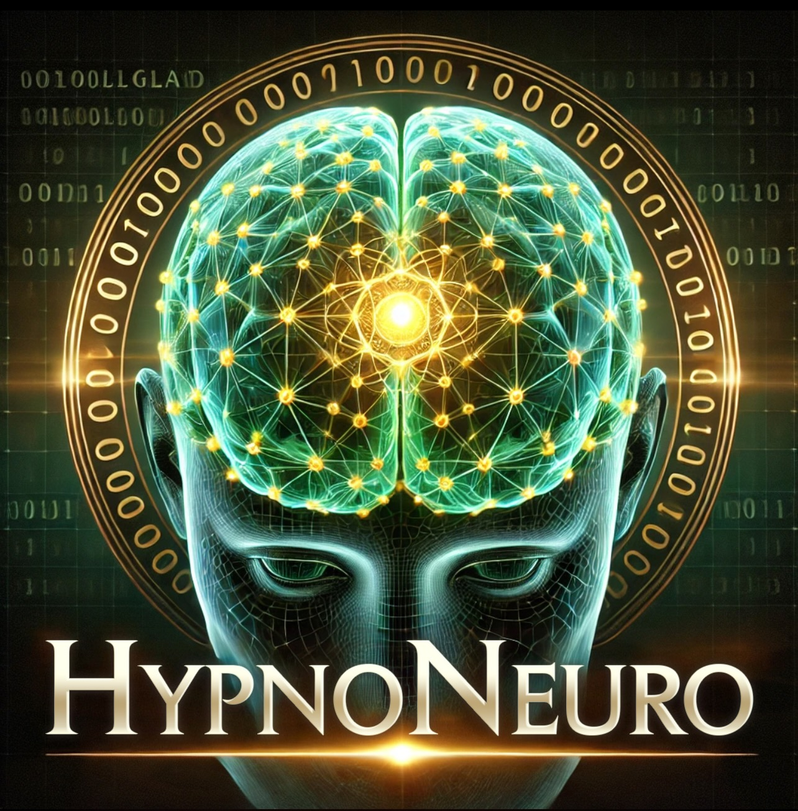
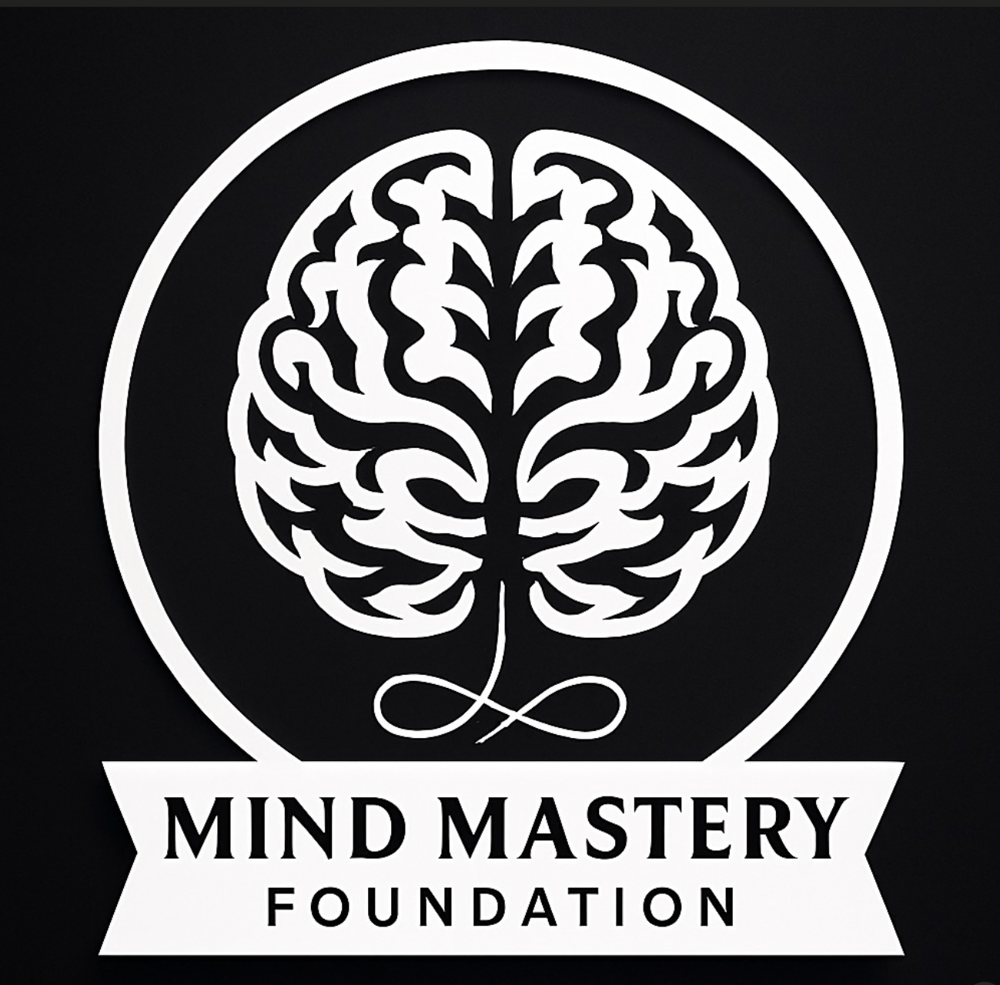
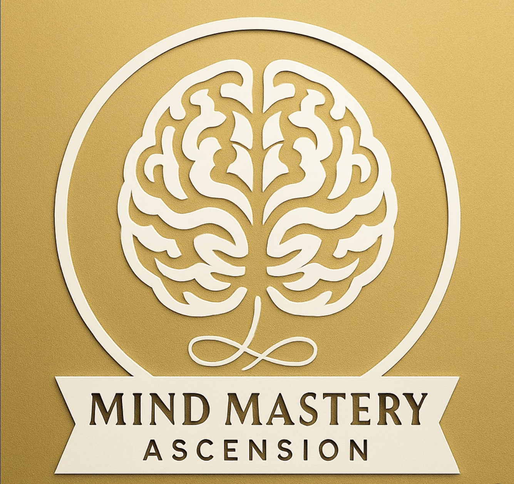

// Rights Reserved, Unlicensed

  

# HypnoNeuro

**HypnoNeuro** is a gamified digital-wellness and neurofeedback platform designed as an *educational tool*, not a clinical system.  
It applies principles of **naturopathic psychology** and **orthomolecular medicine** to help users understand how nutrients, habits, and mindset influence mental and emotional balance.

Participants complete guided learning modules and discrete “**Confirm Meds**” sessions—representing educational actions, not prescriptions.  
Each confirmation records an on-chain engagement event through the **OrthomolecularToken** smart contract, allowing the algorithm to tailor non-PHI, privacy-preserving recommendations for mood, focus, and resilience.

By combining verifiable credentials, decentralized identity, and incentive-based progress tracking, HypnoNeuro promotes self-education and measurable behavior change within the **EncryptHealth** ecosystem.

---

## 🔐 Project Overview

**HypnoNeuro** integrates **ERC-20** and **ERC-721** smart contracts to gamify evidence-based wellness education and reinforce consistent self-care practices.  
It applies principles of **orthomolecular medicine** and **naturopathic psychology** to model how micronutrients, neurochemistry, and behavior interact in mental health.

The platform uses **on-chain tokens** to reward learning milestones and engagement:
- **OrthomolecularToken (OMT)** logs “Confirm Meds” educational actions.  
- **MindMasteryNFT** tracks user progression across learning levels (L1–L3).  
- **EncryptHealthToken (EHT)** supports consent-based data exchange and analytics.

All contracts are deployed to the **Sepolia testnet**, verified on-chain, and interoperable across the **EncryptHealth** ecosystem.

---

## 🧠 Core Tokens

Each token models a specific aspect of the HypnoNeuro educational ecosystem—translating learning milestones and engagement into verifiable on-chain achievements.

| Token | Standard | Purpose | Network | Address | Explorer |
|--------|-----------|----------|----------|-----------|-----------|
| **HypnoNeuroToken (HNT)** | ERC-20 | Legacy governance and reward token for ecosystem actions | Sepolia | 0x8D21A5f67cB60a3B6C02812aEBf3fB894a1b1024 | [View on Etherscan](https://sepolia.etherscan.io/token/0x411426f8E735F7940B20491609F08817A805b198) |
| **OrthomolecularToken (OMT)** | ERC-20 | Tracks “Confirm Meds” educational confirmations for nutrient-based learning modules | Local / Sepolia | 0x5FbDB2315678afecb367f032d93F642f64180aa3 | [Local Demo Details](#-local-demo--hardhat--metamask) |
| **MindMasteryNFT** | ERC-721 L1–L3 | Represents learner progression through Foundation, Elevation, and Ascension levels | Sepolia | 0xCb9EcB00574DB29976c7C54045d443666D5C7771
 | [MindMasteryNFT (L1–L3) — View on Sepolia Etherscan](https://sepolia.etherscan.io/address/0xCb9EcB00574DB29976c7C54045d443666D5C7771)

| **EncryptHealthToken (EHT)** | ERC-20 | Enables privacy-preserving data consent and analytics integration across EncryptHealth | Sepolia | 0xbDaeb1d05E02D2751Ad07121510b5f0C436E2CdC | [View on Sepolia Etherscan](https://sepolia.etherscan.io/token/0x9F1C5EaD6c8B82E7818A9b0E959C947cFE5288B)

Each token is verified on-chain and functions as part of an educational, non-PHI feedback loop that reinforces nutrient- and behavior-based mental wellness learning.

---

## 🧩 Token Logic

- **HNT (HypnoNeuroToken):** Legacy governance and reward token that supports DAO-based decision-making and recognition for educational participation.  
- **OMT (OrthomolecularToken):** Powers the “Confirm Meds” learning confirmations, recording discrete non-PHI engagement events that represent educational reinforcement in orthomolecular principles.  
- **MindMasteryNFT:** Tracks learner progression through three mastery tiers—Foundation (L1), Elevation (L2), and Ascension (L3)—each reflecting deeper educational achievement.  
- **EHT (EncryptHealthToken):** Enables privacy-preserving consent management and analytics exchange between HypnoNeuro and the broader EncryptHealth network.  

Together, these tokens form an educational, privacy-first ecosystem where learning actions and progress are transparently verifiable on-chain.

---

## 🌐 Ecosystem Links

**Core Repositories**
- [EncryptHealth Repository](https://github.com/Future-Systems-Lab/EncryptHealth)
- [HypnoNeuro Repository](https://github.com/Future-Systems-Lab/HypnoNeuro)

**Smart Contracts (Sepolia)**
- [HypnoNeuroToken (HNT)](https://sepolia.etherscan.io/token/0x411426f8E735F7940B20491609F08817A805b198) – Governance and educational reward token  
- [MindMasteryNFT (L1–L3)](https://sepolia.etherscan.io/token/0xF0E17D991EFC79B734A8fC43f2dEda0022F2F) – Learning progression NFTs  
[EncryptHealthToken (EHT) — View on Sepolia Etherscan](https://sepolia.etherscan.io/token/0xbDaeb1d05E02D2751Ad07121510b5f0C436E2CdC)

**Local Development (Hardhat Demo)**
- [OrthomolecularToken (OMT)](#-local-demo--hardhat--metamask) – Educational token used in the “Confirm Meds” module for discrete, non-PHI engagement events

---

## 🧠 Architecture Summary

1. **Frontend:** Next.js + Wagmi v2 for MetaMask interaction, running locally on Hardhat RPC `31337`.  
2. **Smart Contracts:** Solidity suite including OrthomolecularToken (local demo), HypnoNeuroToken, MindMasteryNFT, and EncryptHealthToken (all verified on Sepolia).  
3. **Backend Integration:** Prototype mapping for HL7/FHIR and decentralized consent (DID/OIDC4VP) to demonstrate how educational engagement could link to interoperable, privacy-preserving records.  
4. **Analytics Layer:** Token-based engagement metrics and non-PHI learning progression, with future visualizations planned via Dune or The Graph.

See the full system diagram in [ARCHITECTURE.md](./ARCHITECTURE.md).

---

## 🧠 Local Demo — Hardhat + MetaMask

This section documents the verified local development workflow for the OrthomolecularToken demo.

### Run Locally
\`\`\`bash
cd ~/HypnoNeuro
npx hardhat node --hostname 0.0.0.0
cd web
pnpm exec next dev -p 3012
\`\`\`

### MetaMask Setup
| Field | Value |
|-------|--------|
| **Network Name** | Hardhat Localhost |
| **RPC URL** | http://127.0.0.1:8545 |
| **Chain ID** | 31337 |
| **Currency Symbol** | ETH |

### Usage
1. Open [http://localhost:3012/omt](http://localhost:3012/omt)  
2. Click **Connect Wallet** and approve MetaMask popup.  
3. Click **Confirm Meds** to send a transaction to your local Hardhat contract.  

✅ Verified connection between Hardhat RPC \`31337\` and MetaMask.

---

## Diagrams
- [System Architecture](./ARCHITECTURE.md)  
- [Token, NFT, and Compliance Flow](./TOKEN_FLOW.md)

## Docs
See index in [docs/INDEX.md](./docs/INDEX.md).

## Tokenomics
See [docs/TOKENOMICS.md](./docs/TOKENOMICS.md).

## Contracts
See [docs/CONTRACTS.md](./docs/CONTRACTS.md).

## CI

## Quickstart
See [docs/QUICKSTART.md](./docs/QUICKSTART.md).

---

## 🧾 Verification
All tokens verified and published via Hardhat flattening and `npx hardhat verify` before linking to GitHub.

---

## 🪙 Token & NFT Logos

| HypnoNeuroToken (HNT) | OrthomolecularToken (OMT) | MindMasteryNFT – Foundation | MindMasteryNFT – Elevation | MindMasteryNFT – Ascension | EncryptHealthToken (EHT) |
|------------------------|----------------------------|-----------------------------|-----------------------------|-----------------------------|---------------------------|
|  |  |  |  |  |  |

[HypnoNeuroToken (HNT) — View on Sepolia Etherscan](https://sepolia.etherscan.io/address/0x411426f8E735F7940B20491609F08817A805b198)

---

© 2025 Future Systems Lab. All Rights Reserved.
 
