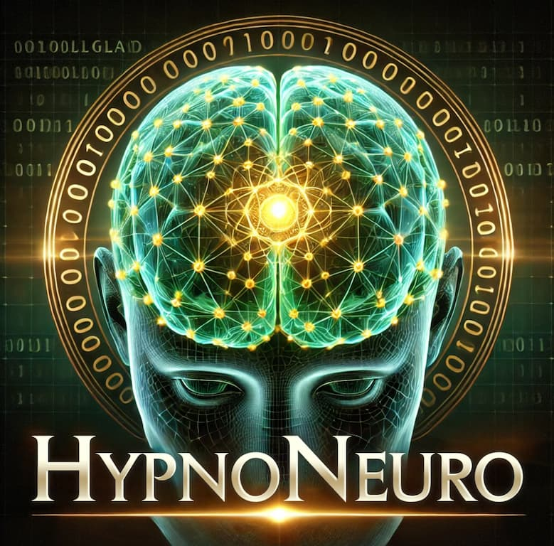

  

# HypnoNeuro™: Where Mental Wellness Meets the Metaverse™

HypnoNeuro™ is a decentralized, gamified mental wellness system rooted in trauma-informed care, privacy-by-design, and natural healing. Built on Ethereum and IPFS, it replaces shame, overmedication, and inaccessibility with avatar anonymity, tokenized access, and reward-based healing.

This platform exists because the current mental health system ignores trauma, punishes vulnerability, and betrays its own ethical foundation: *first, do no harm*.

---

## 🌿 Purpose and Ethos

HypnoNeuro is designed to guide the consciousness through grief, loss, depression, anxiety, insomnia, childhood wounds, and trauma using **gamified naturopathic and orthomolecular methodologies**.

This system is not a distraction tool. It is a **living, adaptive system for transformation**.

---

## 🩺 Creator’s Background

Created by **Dr. Meg Montañez-Davenport**, a naturopathic doctor with **advanced training in neuroscience at Duke University** and a **doctorate in naturopathic psychology with a focus in orthomolecular psychiatry**.

Lived experience of childhood abuse, homelessness, and the loss of an older brother to suicide shaped the foundation of this system, grounding it in compassion and practicality while aligning it with science and measurable outcomes.
The journey through these depths revealed that **healing requires acceptance of what is while consciously creating anew**.

---

## 🧪 Orthomolecular Psychiatry and Naturopathic Psychology

- **Orthomolecular Psychiatry** uses targeted amino acids, vitamins, minerals, and nutrients to support biochemical recalibration, addressing underlying contributors to emotional struggles.
- **Naturopathic Psychology** recognizes the inseparability of mind, body, and spirit, applying nature-based approaches, present-moment awareness, and somatic practices to guide the system toward alignment.

These frameworks work with the body’s innate intelligence while respecting the pace of the healing process.

---

## 🕊️ Purpose of HypnoNeuro Games

All HypnoNeuro game modules are designed to **anchor real-world practices into daily life**:

- When tea preparation is suggested, the system guides its preparation physically.
- When a breathing exercise is offered, the system instructs on its practice.
- When heaviness is present, the system can deploy a hypnosis module for grounding and acceptance.
- When stagnation is detected, the system can provide nutritional practices supporting the nervous system.

These practices are **embodied, trackable, and integrated**, allowing the user to experience real change beyond the screen.

---

## 🌌 Why This Matters

Many systems manage symptoms.  
HypnoNeuro is designed to **facilitate deep healing**, transforming helplessness into conscious creation while honoring the body’s pace and the cyclical nature of grief and healing.

**Healing does not require perfection, only presence.**

This platform exists because the current mental health system ignores trauma, punishes vulnerability, and betrays its own ethical foundation: *first, do no harm*.

---

🛤️ Future Development
The system is designed for scalable expansion.

While initial modules address grief, depression, anxiety, insomnia, and childhood wounds, future development will extend these methodologies to more complex conditions including:

Schizophrenia

Bipolar Disorder

Personality Disorders

These conditions often share root causes in unresolved trauma and biochemical imbalances, encompassing both physical and nonphysical dimensions.

The vision is to apply the same naturopathic psychology and orthomolecular psychiatry frameworks within a gamified, decentralized system, offering scalable, stigma-free support for individuals navigating severe mental health challenges.

---

## 🔍 What This Repo Contains

This repository houses the **core datasets, research models, tokenomics, and foundational modules** powering the HypnoNeuro platform.

### 📂 Key Folders

* `data/` – Cleaned datasets used for AI/NLP modeling and predictive analytics
* `gamified_modules/` – Healing room mechanics and logic (e.g., Mind Loop, trauma tiers)
* `mental_health_models/` – Jupyter notebooks for depression prediction, symptom modeling, and behavioral mapping
* `presentation/` – Pitch decks, tokenomics slides, and stakeholder summaries
* `queries/` – SQL/data queries used in behavioral and clinical ETL pipelines
* `research/` – Scientific and clinical rationale for naturopathic and non-pharma therapies
* `visuals/` – Logos, NFTs, slide assets, and system diagrams

---

## 📄 Featured Documents

* [`HypnoNeuro_Crypto_Whitepaper.md`](grants/HypnoNeuro_Crypto_Whitepaper.md)
  – Tokenomics breakdown, NFT tiers, staking logic, and smart contract architecture

* [`amino-vs-pharma.md`](amino-vs-pharma.md)
  – FAERS + DAWN mortality comparison: amino acid therapy vs psychiatric pharmaceuticals

* [`system_overview.pdf`](presentation/system_overview.pdf)
  – System architecture showing avatar flows, token utility, and decentralized ID layers

---

## 🧠 Technology Stack

* **ERC-20 Token** – HypnoNeuro Token (HNT) for in-app purchases, session access, and progression
* **ERC-721 NFTs** – Soulbound mental health achievements unlocking future discounts and tiers
* **Ethereum + Polygon** – Smart contract infrastructure, scalable and compatible
* **IPFS + Filecoin** – Decentralized encrypted record storage
* **DID + ENS + ZKPs** – Privacy-preserving identity, anonymous logins, and proof-of-progress without exposure
* **OMOP Standardization** – Harmonizing de-identified data for ethical AI and predictive analytics
* **MetaMask + WalletConnect** – Secure, pseudonymous wallet-based access to therapy and peer support

---

## 🌐 Related Projects

* 🔗 [Main GitHub Profile](https://github.com/Where-Mental-Wellness-Meets-Metaverse)
* 🔗 [Crypto Token Site](https://where-mental-wellness-meets-metaverse.github.io/hypnoneuro-crypto/)

---

## 📫 Contact

* **Email:** [dr.meg.data.scientist@gmail.com](mailto:dr.meg.data.scientist@gmail.com)
* **Website:** hypnoneuro.com *(Coming Soon)*
* **Twitter:** [@hypno\_neuro\_333](https://twitter.com/hypno_neuro_333)

---

## 📜 License

© 2025 Dr. Meg Montañez-Davenport. All rights reserved.

This repository and all its contents, including but not limited to source code, architecture, tokenomics, branding, and research materials, are protected under intellectual property laws. Unauthorized reproduction, distribution, or modification is strictly prohibited without explicit written permission from the creator.

**This work is not open source.** It is published for visibility, strategic collaboration, and investor review only.

Licensing inquiries may be directed to: **[dr.meg.data.scientist@gmail.com](mailto:dr.meg.data.scientist@gmail.com)**
