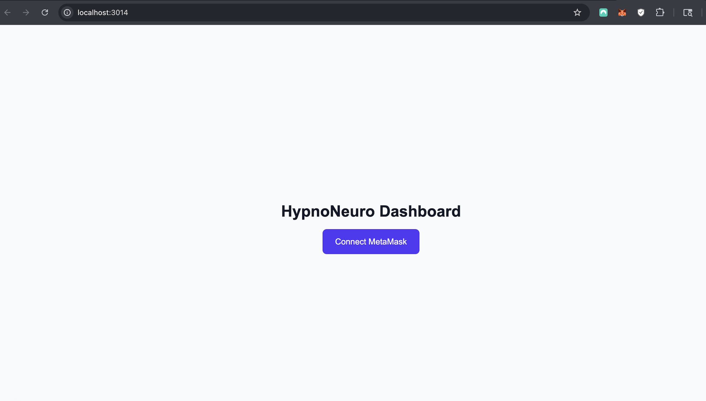

// Rights Reserved, Unlicensed

# 🧠 HypnoNeuro

Gamified decentralized mental-wellness ecosystem integrating verifiable credentials, token rewards, and practitioner consent modules.

---

## Overview

HypnoNeuro connects **patients and practitioners** in a privacy-first ecosystem using decentralized identity and token incentives.  
Built under the **Future Systems Lab**, it links wellness compliance, consent governance, and reward tokens through smart contracts and wallet-based authentication.

### Current MVP (Phase 1)

- MetaMask login flow (working)
- Consent toggle demo (mock HL7/FHIR adapter)
- HypnoNeuroToken ERC-20 on Sepolia
- NFT credentialing (MindMasteryNFT L1–L3)
- Practitioner + User dashboards
- Local analytics view (session compliance)
- Ready for Phase 2: DAO governance + token-minted rewards

---

## Screenshots

| Step | Preview |
|------|----------|
| Login |  |
| Wallet Connect |  |
| Dashboard |  |

---

## Smart Contracts (Deployed on Sepolia)

| Contract | Address | Description | Explorer |
|-----------|----------|--------------|-----------|
| **HypnoNeuroToken** | `0x8D21A5F67eB60aB36C0281a2E8F3F8894aB18D24` | ERC-20 governance + rewards | [View on Etherscan](https://sepolia.etherscan.io/address/0x8D21A5F67eB60aB36C0281a2E8F3F8894aB18D24) |
| **MindMasteryNFT** | `0xF0E17EDE991EFc79B734A8f4Cc34F20Eda00222F` | ERC-721 L1–L3 credential NFT | [View on Etherscan](https://sepolia.etherscan.io/address/0xF0E17EDE991EFc79B734A8f4Cc34F20Eda00222F) |
| **EncryptHealthToken** | `0x9F1C5EaD6c8B28E7818A9b0E995C9470CcfE52B8` | Shared token utility with EncryptHealth | [View on Etherscan](https://sepolia.etherscan.io/address/0x9F1C5EaD6c8B28E7818A9b0E995C9470CcfE52B8) |

---

## Run Locally

\`\`\`bash
cd web
pnpm install
pnpm exec next dev -p 3012
\`\`\`

Then open:  
http://localhost:3012

---

© Future Systems Lab | HypnoNeuro Project | Rights Reserved, Unlicensed

### View Contracts and Source Code

All verified source files are available inside the repository under  
[`/HypnoNeuroContracts`](https://github.com/Future-Systems-Lab/HypnoNeuro/tree/main/HypnoNeuroContracts)  
and [`/contracts`](https://github.com/Future-Systems-Lab/HypnoNeuro/tree/main/contracts).

For direct on-chain viewing and verification:

| Contract | Network | Address | Explorer |
|-----------|----------|----------|-----------|
| **HypnoNeuroNFT_L1_L3** | Sepolia | `0x8D21A5F67eB60aB36C0281a2E8F3F8894aB18D24` | [View on Etherscan](https://sepolia.etherscan.io/address/0x8D21A5F67eB60aB36C0281a2E8F3F8894aB18D24) |
| **EncryptHealthToken** | Sepolia | `0x9F1C5EaD6c8B28E7818A9b0E995C9470CcfE52B8` | [View on Etherscan](https://sepolia.etherscan.io/address/0x9F1C5EaD6c8B28E7818A9b0E995C9470CcfE52B8) |
| **MindMasteryNFT** | Sepolia | `0xF0E17EDE991EFc79B734A8f4Cc34F20Eda00222F` | [View on Etherscan](https://sepolia.etherscan.io/address/0xF0E17EDE991EFc79B734A8f4Cc34F20Eda00222F) |

These contracts are actively linked within the **Future Systems Lab** ecosystem across  
HypnoNeuro and EncryptHealth, forming a unified digital-health governance layer.
