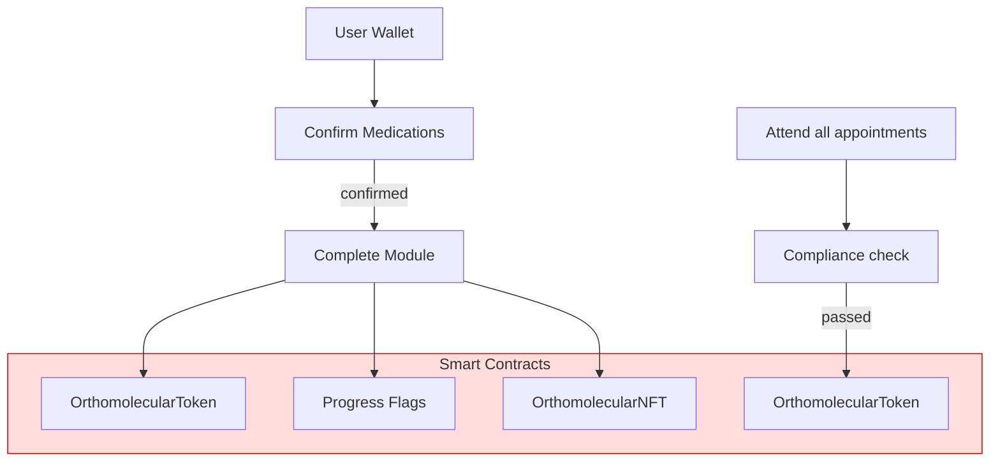

// Rights Reserved, Unlicensed
# Token, NFT, and Compliance Flow

```mermaid
flowchart TD

U["User Wallet"] --> C1["Confirm Medications"]
C1 -->|confirmed| C2["Complete Module"]
C2 --> T1["ERC20: Mint completion tokens"]
C2 --> F1["Set completion flag"]
A1["Attend all appointments"] --> A2["Compliance check"]
A2 -->|passed| T2["ERC20: Mint compliance bonus"]
C2 --> N1["ERC721: Mint badge NFT"]

subgraph Contracts["Smart Contracts"]
T1["OrthomolecularToken"]
T2["OrthomolecularToken"]
N1["OrthomolecularNFT"]
F1["Progress Flags"]
end

style Contracts fill:#fdd,stroke:#c00,stroke-width:1px
```
