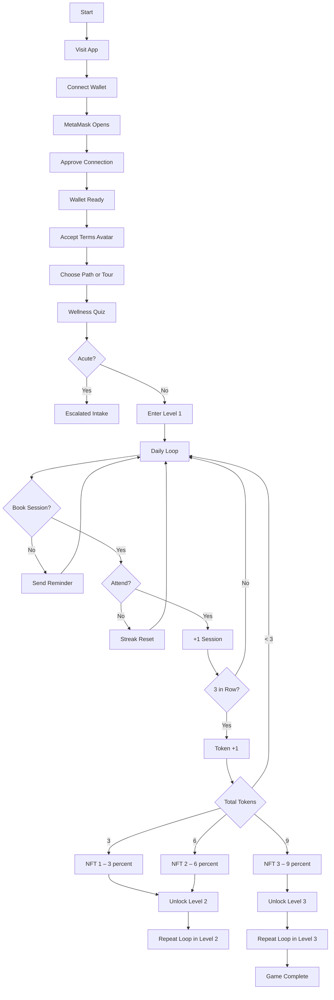

<!--
HypnoNeuro – Full Game Flow  
Copyright © 2025 Dr. Meg Montañez-Davenport. All Rights Reserved.
-->

<!--
HypnoNeuro – Full Game Logic Diagram
Copyright © 2025 Dr. Meg Montañez-Davenport. All Rights Reserved.
-->
