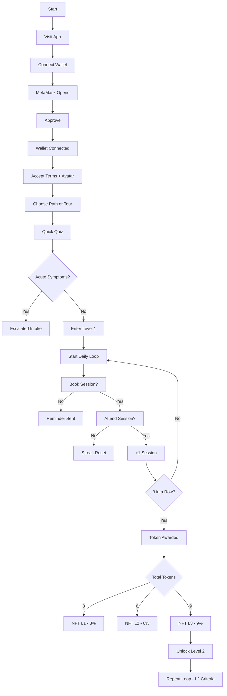

<!--  
HypnoNeuro – Game Logic Flow  
Copyright © 2025 Dr. Meg Montañez-Davenport. All Rights Reserved.  
-->

  U -- 3 --> V[NFT Reward: L1 → 3% Discount]
  U -- 6 --> W[NFT Reward: L2 → 6% Discount]
  U -- 9 --> X[NFT Reward: L3 → 9% Discount]

  X --> Y[Unlock Next Room (L2: Mental W]()

<!--
HypnoNeuro – Full Game Logic Diagram
Copyright © 2025 Dr. Meg Montañez-Davenport. All Rights Reserved.
-->
