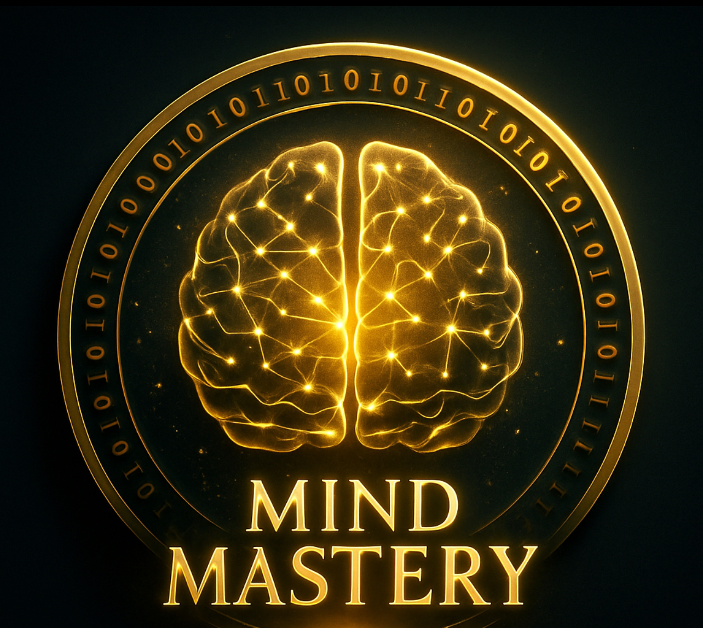

  

  

  

# NFT Images Directory

This folder contains NFT artwork and related image assets for the **HypnoNeuro Mind Mastery NFT collection**.

## Structure

- `Mind_Mastery_NFT.jpeg` – Main Mind Mastery NFT image for testing, demonstration, and NFT minting.
- Additional NFT images will be uploaded here for:
  - Design alignment  
  - Pre-mint analysis workflows  
  - Showcase integration  
  - Game unlock visuals  

## Usage

These images will be referenced in **NFT metadata JSON files** during:
- Smart contract deployment  
- IPFS pinning  
- Metadata linking  
- Stakeholder demos  
- In-game unlock display  

---

## License

All images in this directory are © 2025 HypnoNeuro™.  
Strictly protected intellectual property.  
Unauthorized use, modification, distribution, or minting is prohibited without express written permission.

> **Contact:** [Dr. Meg Montañez-Davenport](mailto:dr.meg.data.scientist@gmail.com) for licensing, collaboration, or NFT inquiries related to the Mind Mastery NFT collection.
