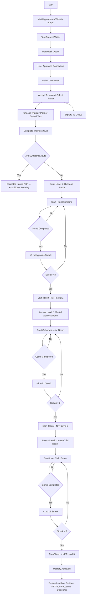

<!-- 
HypnoNeuro™ NFT Unlock Flow  
Copyright © 2025 Dr. Meg Montañez-Davenport. All Rights Reserved.

Dev Note: This logic allows players to unlock NFT-based discounts by completing 3-game streaks across progressive healing levels (Hypnosis, Orthomolecular, Inner Child). Practitioners can be booked once NFTs are earned. Guest mode disables token rewards.
-->

HypnoNeuro — Intellectual Property Statement  
Copyright © 2025 Dr. Meg Montañez-Davenport. All Rights Reserved.

This content, design flow, logic structure, and therapeutic gamification sequence  
are the sole intellectual property of Dr. Meg Montañez-Davenport and HypnoNeuro.  
No portion of this document may be reused, duplicated, tokenized, commercialized,  
or repurposed without express written consent.

All rights reserved under applicable international copyright and IP law.  
Violators will be prosecuted to the fullest extent permitted by law.
-->
