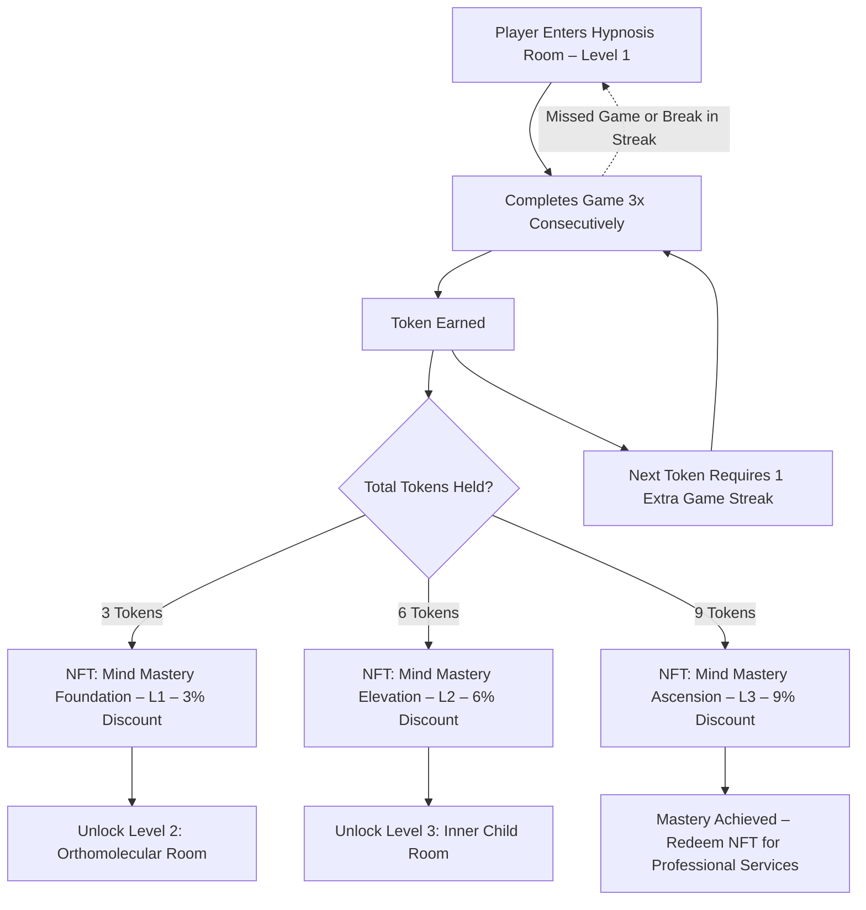

---
**Developer Notes:**
- Players must complete **3 consecutive successful plays** to earn a token.
- Each **week**, the token requirement increases by one set (e.g. 3 games → 6 → 9), promoting skill mastery.
- NFTs are **non-transferrable badges** and act as keys to unlock future levels **and** redeem professional services.
- Missed sessions reset the streak. Progress is non-linear but rewards commitment.

---
**Copyright © 2025 Dr. Meg Montañez-Davenport. All Rights Reserved.**
